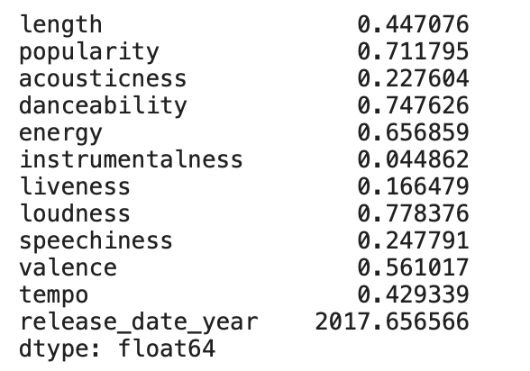
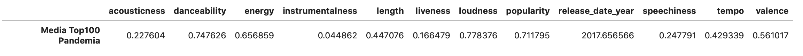

# Overview

## Using % and .format()
```python
'{} {}'.format('one', 'two')
print("Hello {}, your balance is {}.".format("Adam", 230.2346))
print("Hello {name}, your balance is {blc}.".format(name="Adam", blc=230.2346))
forecast_graphic_final.to_csv("graphs_article/graph_features_forecasting_{}.csv".format(feature), sep = ',')
```
More useful and info: https://pyformat.info

## Cambiar color celda Jupyter Notebook

```python
from IPython.display import HTML, display
def set_background(color):    
    script = (
        "var cell = this.closest('.jp-CodeCell');"
        "var editor = cell.querySelector('.jp-Editor');"
        "editor.style.background='{}';"
        "this.parentNode.removeChild(this)"
    ).format(color)

display(HTML(''.format(script)))

set_background('honeydew')
```

## Transformar dataframe

Inicial
```python
data_ana_playlist_means_songs100 = data_ana_playlist_songs100.mean()
data_ana_playlist_means_songs100
```


Después
```python
data_ana_playlist_means_songs100 = data_ana_playlist_songs100.mean().reset_index()
data_ana_playlist_means_songs100 = data_ana_playlist_means_songs100.pivot_table(columns='index',
                                            index=data_ana_playlist_means_songs100.index//len(data_ana_playlist_means_songs100),
                                            values=0).rename_axis(None, axis=1).rename(index={0: 'Media Top100 Pandemia'})

data_ana_playlist_means_songs100
```


## Merge 3 varios dataframes

```python
from functools import reduce
dfs = [df0, df1, df2, dfN]
df_final = reduce(lambda left,right: pd.merge(left,right,on='name'), dfs)
```

## Concat various dataframes

```python
pdList = [df1, df2, ...]
new_df = pd.concat(pdList)
```
